# Building a Custom GameCube Controller: A Journey of Learning and Mistakes

## Introduction

Although I no longer use Gamecube controllers (I switched over to a [B0XX](https://b0xx.com/) about a year ago), I've always been interested in the Gamecube controller modding scene. Shortly after my switch to the B0XX, I heard about the [PHOB project](https://github.com/PhobGCC/PhobGCC-doc), and I knew it was something that I'd love to try to build. One of my friends Michael decided to move away from the city, and since his old Gamecube controller was starting to show its age, I figured I could build him a controller as a going-away present. This controller is inspired by the late rapper Lil Peep (who Michael is a fan of), featuring artwork based on his tattoos. This document will cover journey of building my first GameCube controller from scratch. I will share the process of making the controller, including mistakes and lessons learned along the way. I'll also provide images to help illustrate my progress at each step.

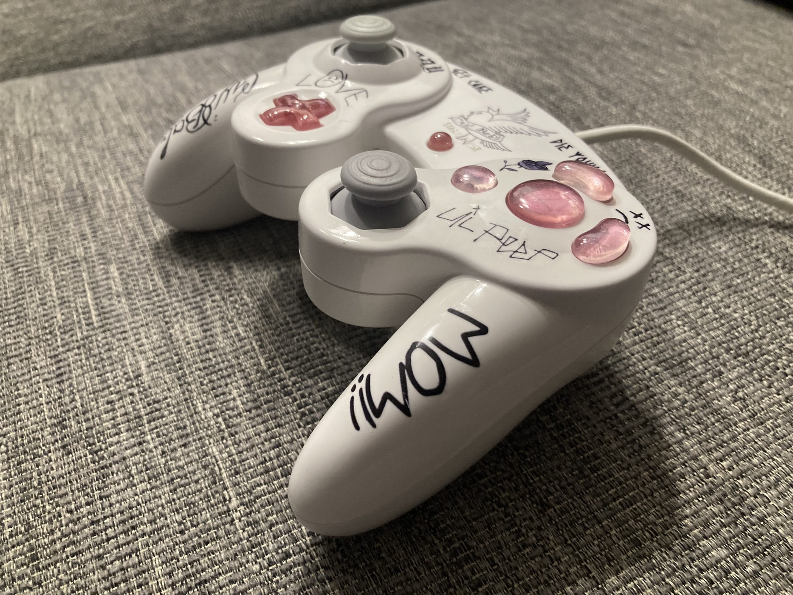

<i>A photo of the completed custom controller</i>

## Part 1: Controller Artwork

### 1.1 Choosing Tattoos and their Positioning

The first step was to select a set of Lil Peep's tattoos to incorporate into the controller's design. I carefully picked tattoos that would not only look great on the controller but also represent his unique style.

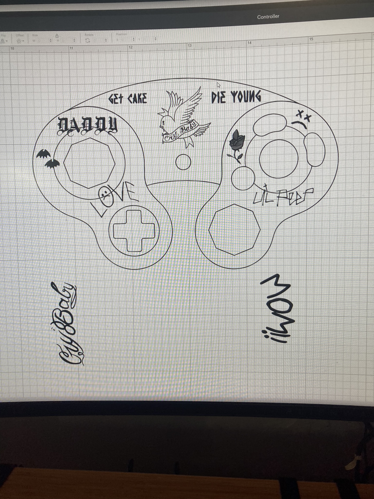

<i>A collage of the chosen tattoos and their proposed positions on the controller</i>

### 1.2 Removing the Nintendo Logo

Since my controller design involved placing a decal in the center of the shell, I needed to remove the Nintendo logo before applying any decals. Initially, I considered painting the controller shell white because it would both remove the Nintendo logo and remove yellowing that my controller built up over the years.

Fortuntately, by soaking and scrubbing the controller shell with hydrogen peroxide, I was able to restore the shell to look perfectly white again. This left me with only the need to remove the Nintendo logo / text to get a completly white shell. After some research, I learned that a magic eraser would do this with minimal abrasive damage to the surrounding area.

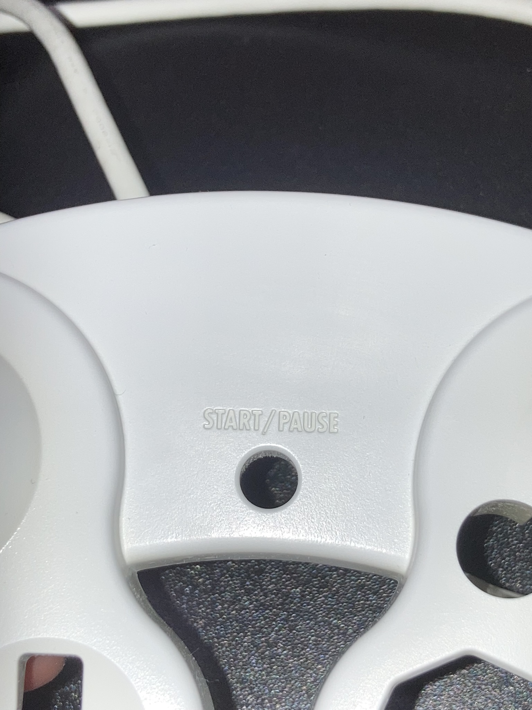

<i>A photo of the shell with the Nintendo logo removed</i>

### 1.3 Preparing the Decals

To create the decals, I cropped the images I found earlier using Paint.NET. This was a good start, but it was difficult to find high-resolution images that would provide a good result when printed. For decals which comprised mostly of clean lines (such as the "Get Cake" text), I used [vectorizer.io](vectorizer.io) to vectorize them. Unfortunately, vectorizers didn't provide a very clean result for more detailed decals (such as the bats). To combat this, I used [imgupscaler.com](imgupscaler.com) to upscale the remaining images.

<i>A screenshot of one of the decals prior to upscaling</i>

### 1.4 Printing and Sealing Decals

I printed the decals onto waterslide decal paper and sealed them with three coats of clear coat paint. This step is crucial to protect the decal ink during the waterslide decal application process.

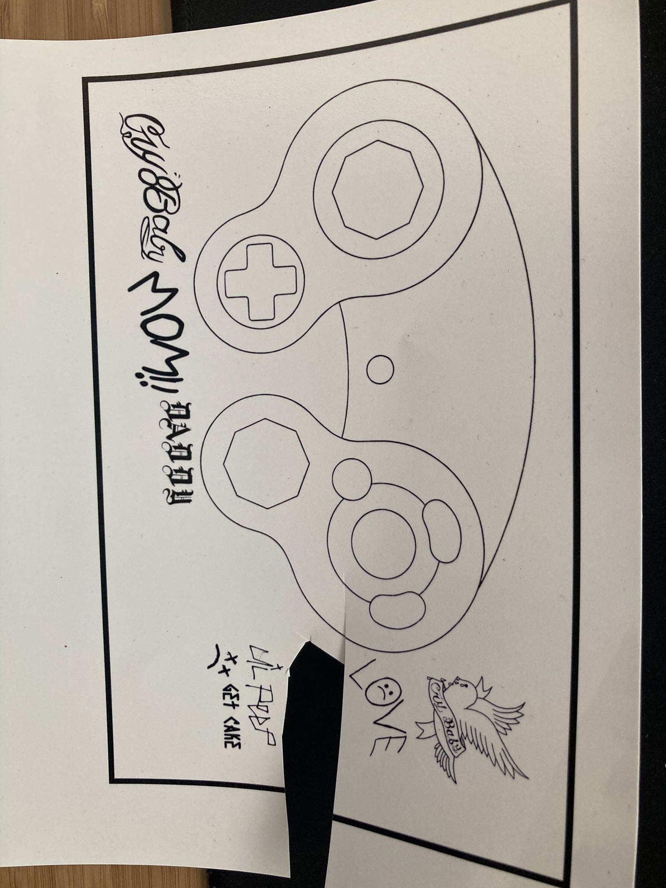

<i>A photo of the printed decals</i>

When applying the decals, I cut each one out, submerged it in water, applied micro-set onto the controller, positioned the decal, dried it with a rag, and applied micro-sol. This was a delicate process that took a few tries to get right. Some of the mistakes that I found were:
- Not enough passes while drying the decals left a large visible borders on the decal edge
- Too many passes while drying the decals risked removing the clear coat and decal ink
- Too much micro-set would cause the decal to shift while drying
- Too much micro-sol would cause the decal to rip while drying

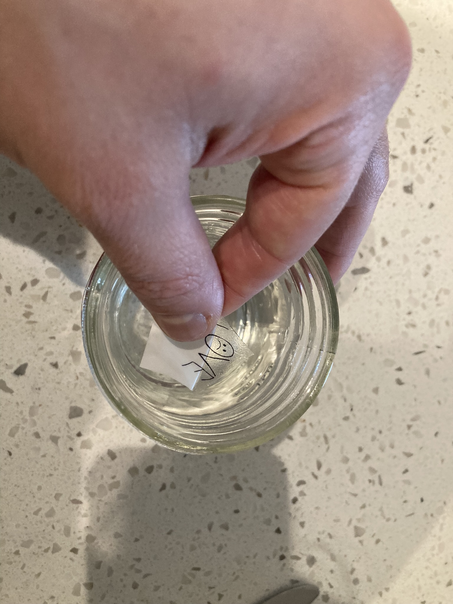

<i>A series of photos showing the decal application process</i>

### 1.5 Clear Coat Application and Safety Precautions

After applying the decals, I used a 2K automotive clear coat to seal and protect them. 2K paint is a two-component paint that, when mixed, creates a durable and high-gloss finish. 2K clear paint was necessary to provide a smooth enough finish for comfortable use and to protect against degradation from oily hands. Unfortunately, 2K paint is also highly toxic, so I took precautions by wearing a respirator, goggles, and a paint suit during the painting process. 

Three coats of clear coat over the controller shell was enough to confidently seal in the decals. Since I was paining outside, I had to also take precautions to prevent contaminants such as dust from getting onto the shell while drying. Letting the shells dry under tupperware allowed for this protection with the small inconvenience of increasing the paint's curing time.

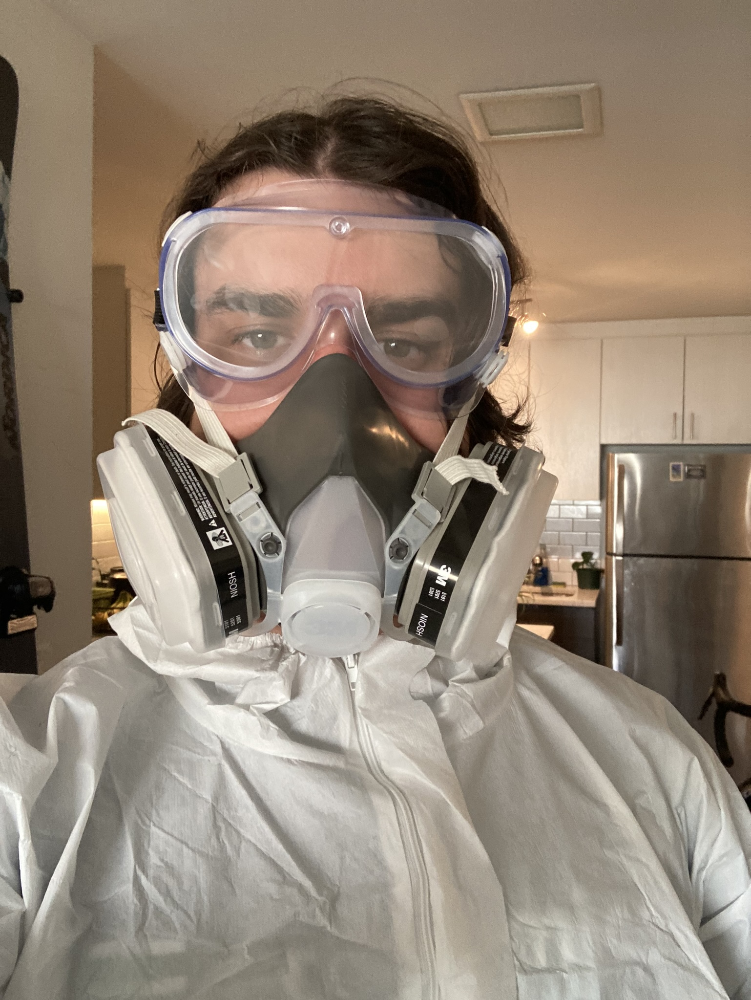

<i>A photo of me wearing the paint suit, respirator, and goggles</i>

### 1.6 Decal Sanding and Finishing

Once the clear coat had cured, I noticed that there were still large visible edges over many of the decals. By sanding the decals with ~3000 grit sandpaper, I was able to level the surface and hide the decal borders. This was also a delicate process as sanding too deep would result in damage to the decals, while sanding too little would keep the borders visible. In hindsight, the optimal way to remove borders with minimal risk or damage to the finish would have been to alternate between applying clear coat, drying, and sanding multiple times.

After sanding, the finish was no longer perfectly even throughout the controller. I was able to restore the clear coat's original finish by applying a light scratch remover along with an acrylic shine to the shell.

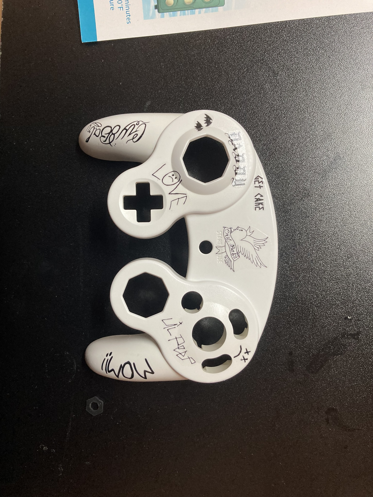

<i>A photo of the decals before sanding and sanding and polishing the decal edges</i>

### 1.7 Mistakes and Lessons Learned

During the artwork process, I encountered a few challenges. Initially, I tried using a Cricut machine to cut the decals after printing them onto waterslide decal paper. However, the cuts were messy, and I decided to cut them by hand instead.

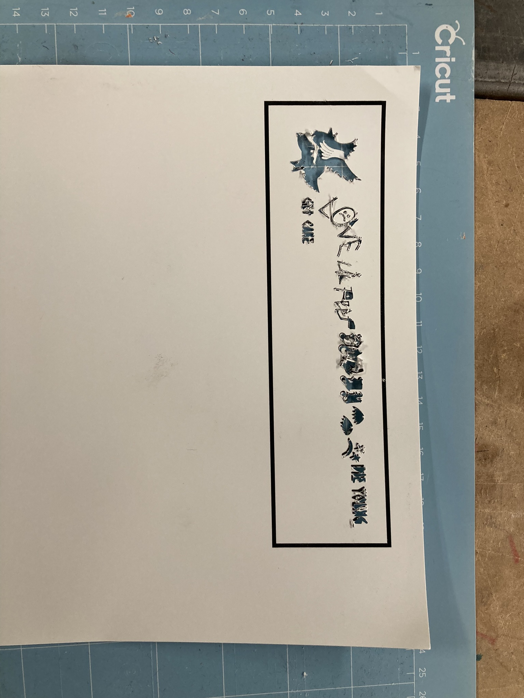

<i>A comparison of the Cricut-cut decal and the hand-cut decal</i>

## Part 2: Custom Picture Buttons

### 2.1 Designing and Ordering Picture Buttons

The picture buttons were the only portion of the controller which I wasn't able to complete myself. While there are resin casing resources available to me, I had concerns about my abililty to create buttons that were the right size. I was also concerned that they wouldn't end up looking up to the standard set by a controller modders that specialize in resin casted picture buttons.

I designed and ordered picture buttons buttons that featured Lil Peep's tattoos from [No Jon's Mods](https://twitter.com/NoJonsMods), a controller modder who specifically specializes in creating picture buttons.

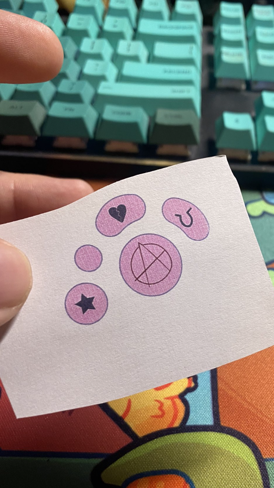

<i>A photo of the proposed picture buttons with Lil Peep's tattoos</i>

### 2.2 Installing the Picture Buttons

Once the picture buttons arrived, I carefully installed them into the controller, making sure they fit and functioned properly.

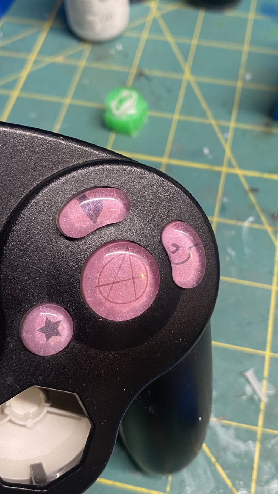

<i>A photo of the controller with the custom picture buttons installed</i>

### 2.3 Mistakes and Lessons Learned

Thankfully, I encountered no significant issues during the picture button design and installation process. This success highlights the importance of working with skilled vendors and planning the design carefully.

## Part 3: PHOB Motherboard Installation

### 3.1 Harvesting Parts from a Donor Controller

To build this custom controller, I used my JP White GameCube controller as a donor. The process involved disassembling the donor controller and harvesting the necessary components described in the next section.

### 3.1 Soldering Components

I swapped the original motherboard for a PHOB motherboard, which incorporates hall-effect sensor sticks. This required soldering the following components to the new motherboard:
- Controller cable
- 2x Trigger potentiometers
- 2x trigger paddles
- C stick ribbon cable
- Z button switch

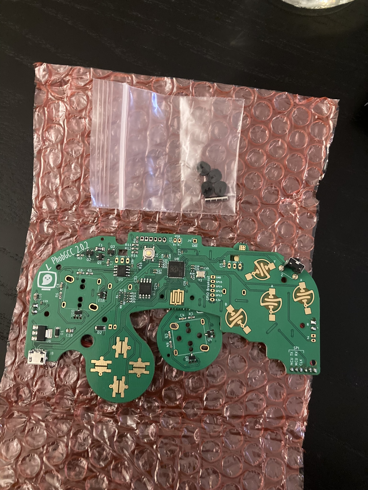

<i>A photo of the motherboard, magnets, and magnet holders before soldering</i>

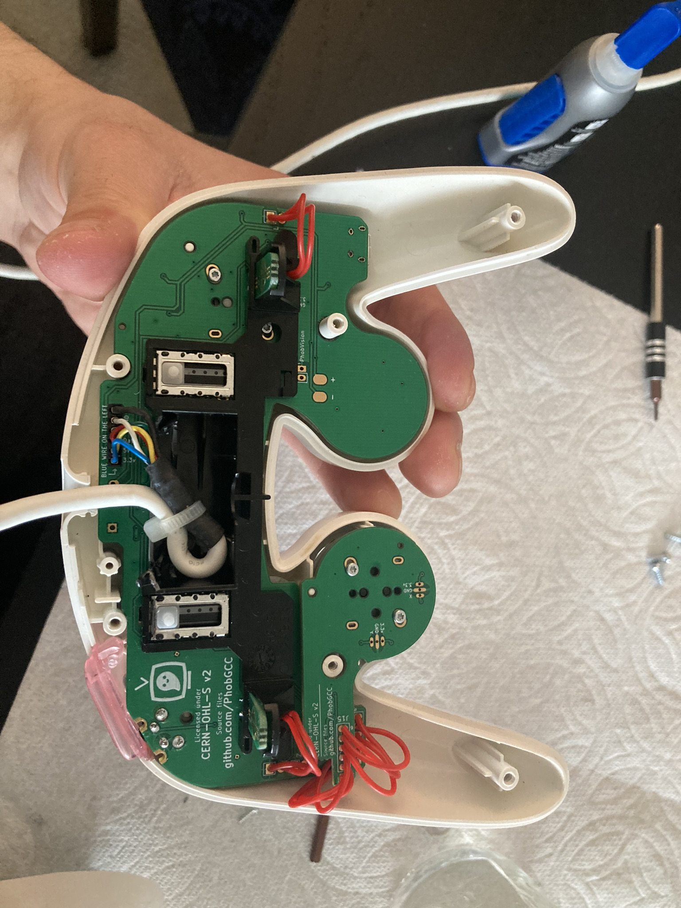

<i>A photo of the motherboard after the soldering and assembly process</i>

### 3.3 Cleaning and Lubricating Stickboxes

To ensure smooth operation, I cleaned the stickboxes once with isopropyl alcohol and applied keyboard switch lubricant to ensure for smooth stickbox travel.

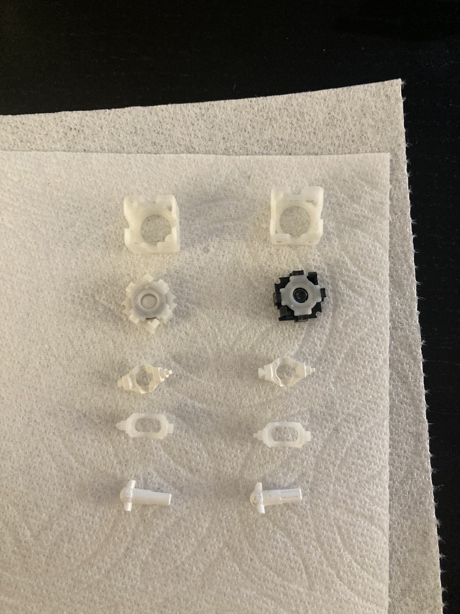

<i>A photo of the cleaned and lubricated stickboxes</i>

### 3.2 Installing Magnets and Attaching Stickboxes to the PHOB Motherboard

To prepare the stickboxes for the PHOB motherboard, I began by gluing the magnets to their 3D printed nylon magnet holders using Loctite super glue. Then, I used the same glue to attach the magnets and holders to the sides of the stickboxes. Once the glue had dryed, I secured the stickboxes to the PHOB motherboard.

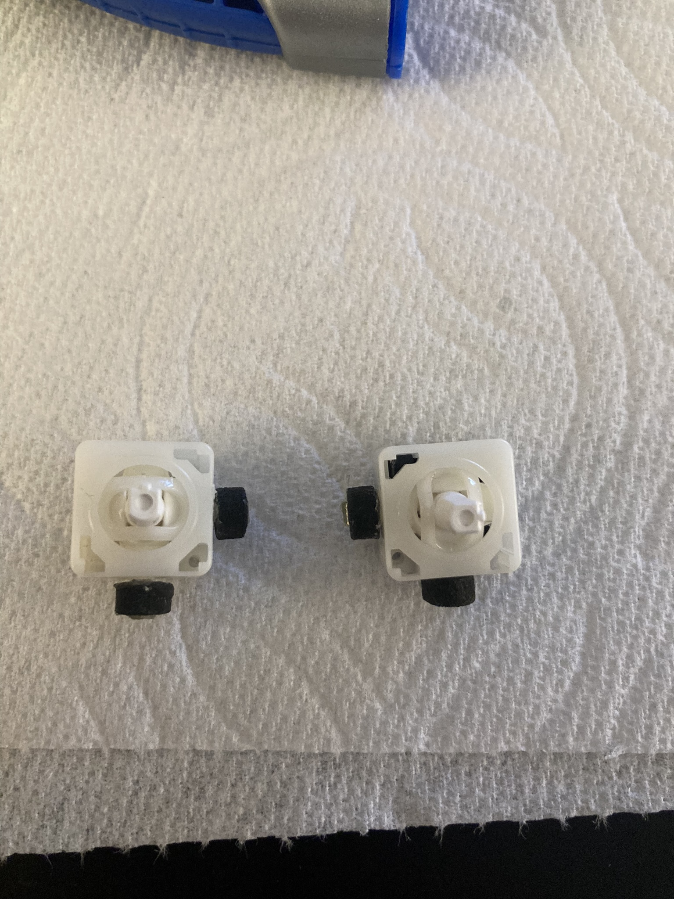

<i>A photo of the magnets glued to the magnet holders and stickboxes, and the stickboxes attached to the motherboard</i>

### 3.4 Mistakes and Lessons Learned

Initially, I encountered an issue when trying to close the controller. I needed to trim down the button pads more than advised in the build gide to ensure a proper fit. Through this challenge, I learned the importance of adjusting to the unique requirements of custom parts.

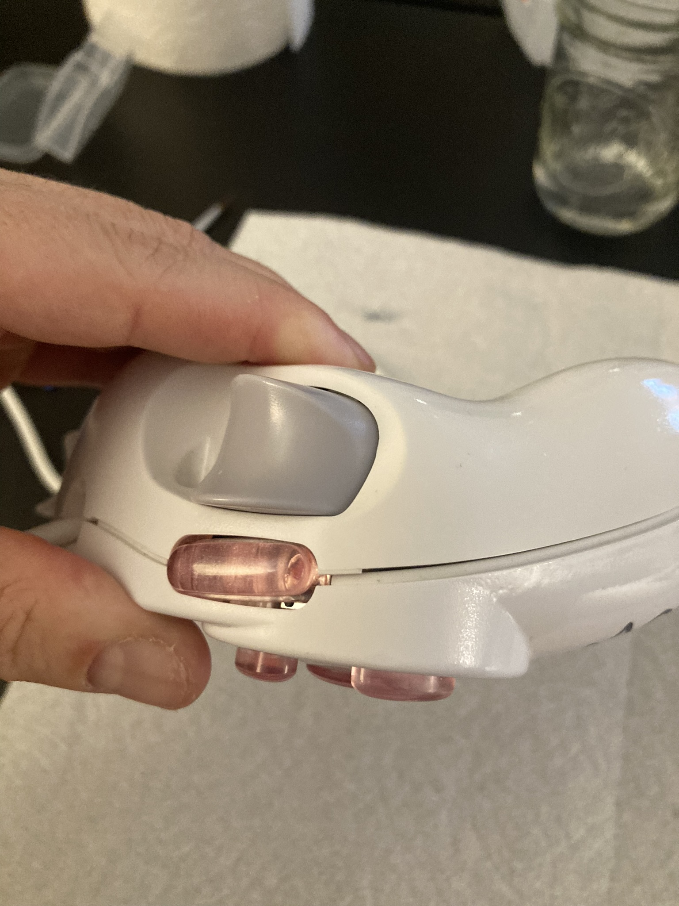

<i>A photo of the controller unable to be closed due to a large gap</i>

## Part 4: Quality of Life Improvements

### 4.1 Torx Screw Replacement

To make future reassembly easier, I replaced all screws on the controller (shell, trigger bracket, stickbox) with torx screws.

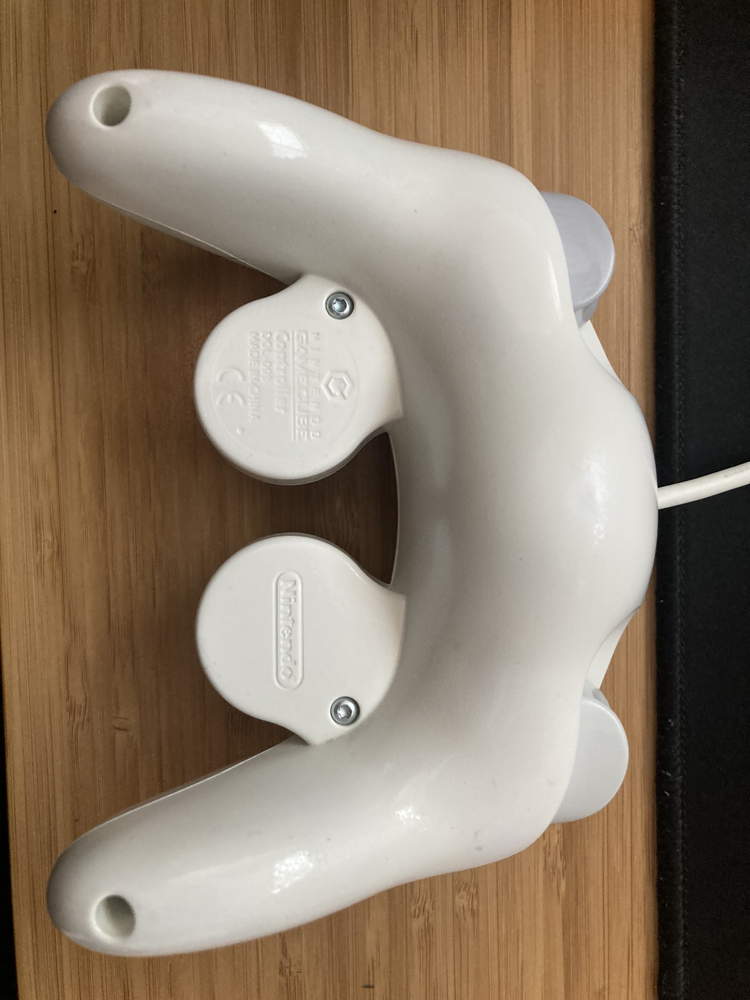

<i>A photo of the controller's back shell assembled with torx screws</i>

### 4.2 Trigger Upgrades

Following [Fires Customs Stage 1 Triggers Guide](https://firescc.com/fires-triggers-stage-1), I experimented with various combinations of different length trigger plugs, different numbers of o-rings, and different amounts of silicone tape to achieve the right feel. After several attempts, I finally found the optimal setup for both triggers.

Both triggers received aftermarket ["Rienne springs"](https://www.riennecustoms.com/shop/aftermarket-gamecube-controller-trigger-springs-set-of-2-pre-lubed/) and low friction silicone tape to increase travel smoothness. The left trigger was given a long trigger plug, two o-rings, and was set to digital-only mode to serve as a powershield button, while the right trigger had no plug or o-rings added to remain a general-purpose (analog + digital) trigger. 

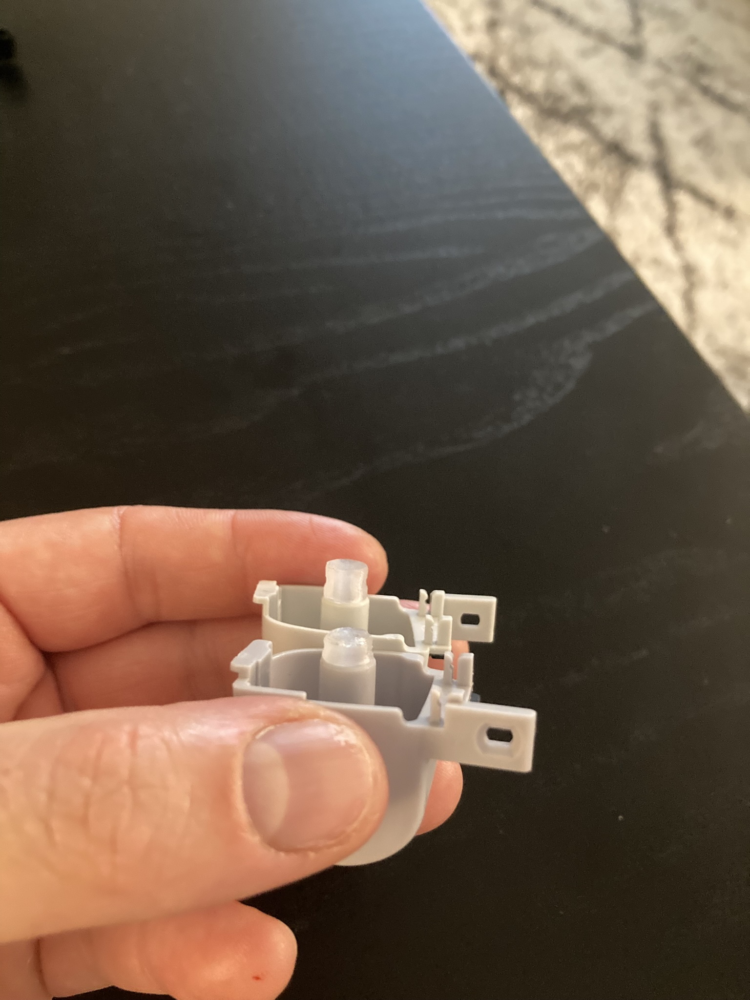

<i>A photo of the triggers with trigger plugs installed</i>

### 4.3 Stickbox Spring Replacement

The donor controller I supplied has seen many games throughout its years, meaning that the stickboxes were quite worn in. To add longevity to the controller, I replaced the stickbox springs with fresh springs. I chose to use the newest revision stickboxes ([CFS8280-500020-00 E4 (T3)](https://gccontrollerlibrary.com/guides/gamecube-controller-internals-guide/)) as these are known to have the stiffest springs. While one of the PHOB's features are a snapback reduction signal filter, using a stiffer spring allows for natural snapback reduction with incurring the responsiveness reduction that this filter introduces.

The combination of the new stickbox spring along with the stickbox lubricant has made the controller feel super responsive.

### 4.4 Out of Scope Considerations

I considered adding shell notches and a paracorded cable to the custom controller but decided against them. While I was able to successfully add hybrid max-distance wavedash + firefox notchs with the correct coordinates (Y->0.33) on one of my other controller shells, they felt quite difficult to slot the stick into, which wasn't up to the quality I would have liked for this controller. Had I had additional shells to practice on, I would have continued learning to add notches, but it wasn't worth the of risk damaging the only white shell I had. 

I also considered adding an aftermarket paracord cable to the controller, but ultimately decided against it because aftermarket gamecube cables have a higher failure rate than OEM cables.

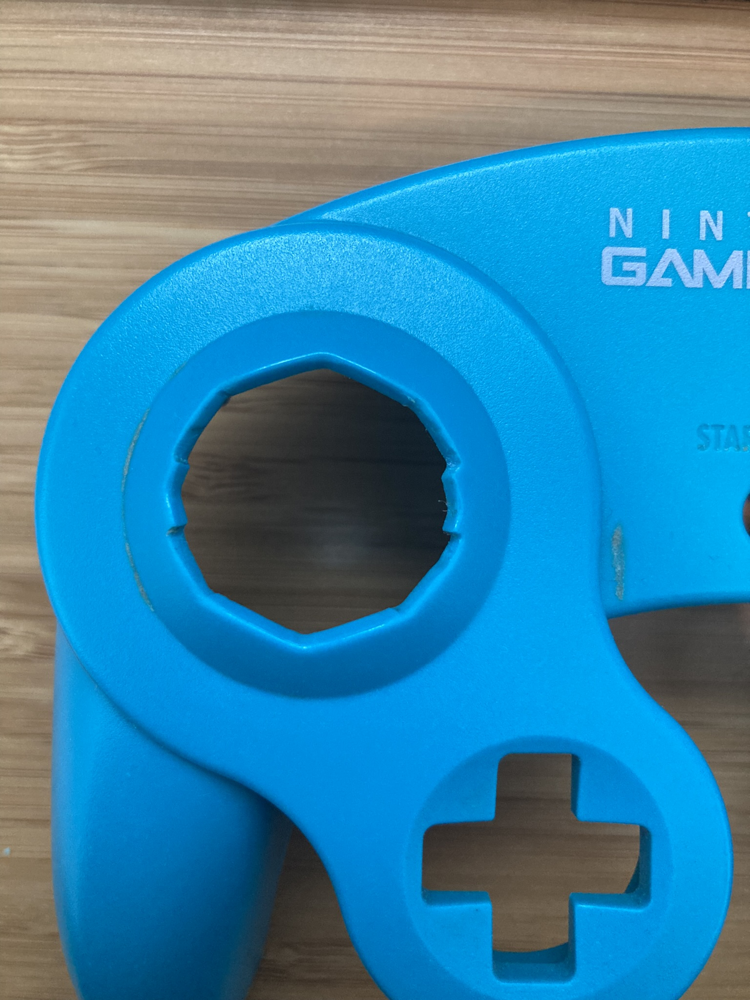

<i>A photo of notches that I added to my Emerald Blue Gamecube controller</i>

## Conclusion

Throughout this journey, I've learned that building a custom GameCube controller is a challenging but rewarding process. By learning from my mistakes and sharing my experiences, I hope this blog post can help others who embark on a similar journey. I'm thrilled with how the final product turned out, and I'm sure Michael will love his one-of-a-kind Lil Peep-inspired controller.

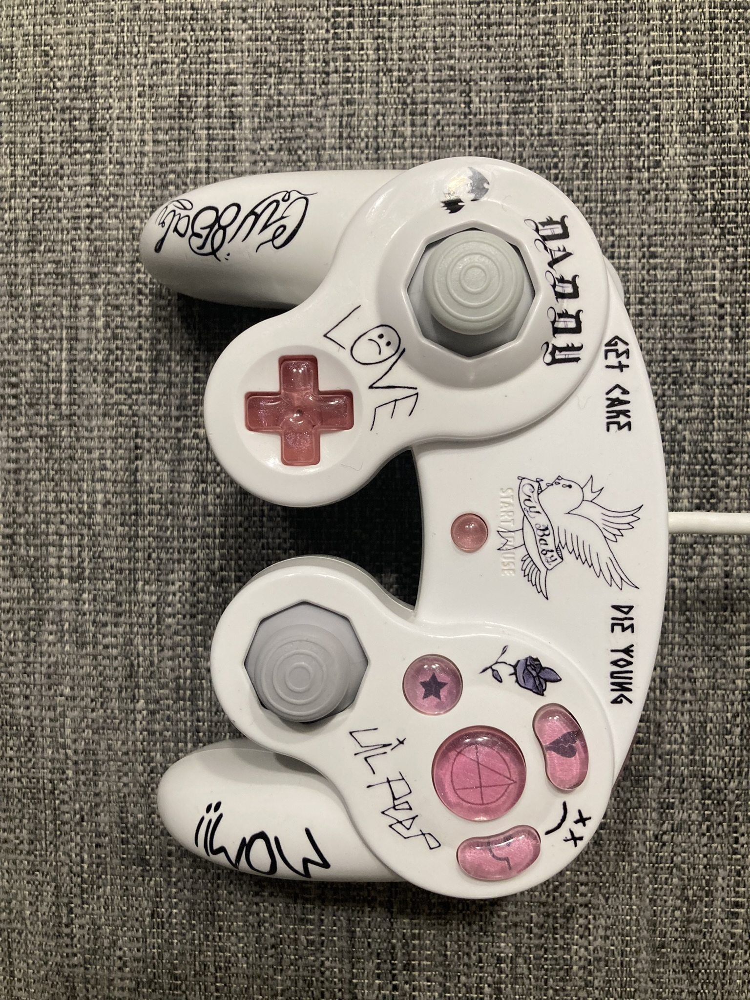

<i>A photo of the completed controller</i>

